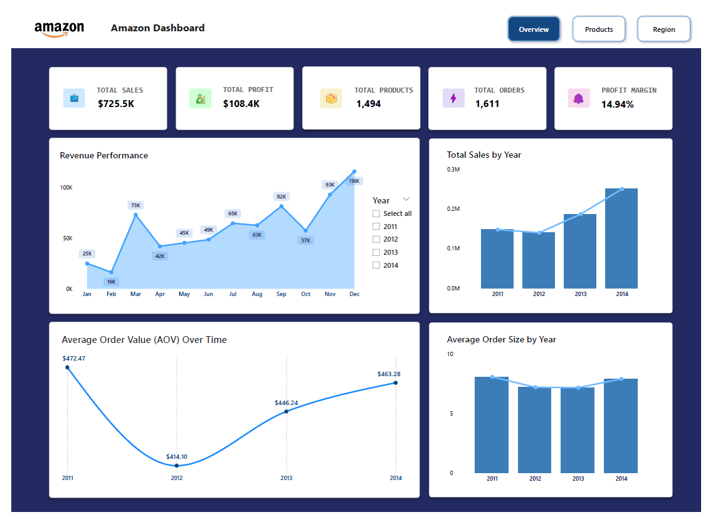
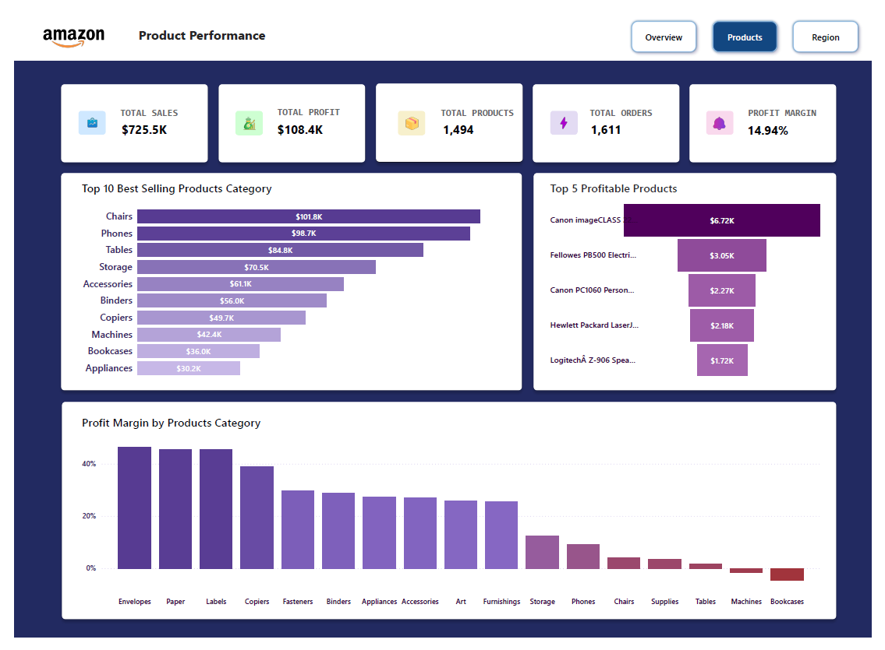
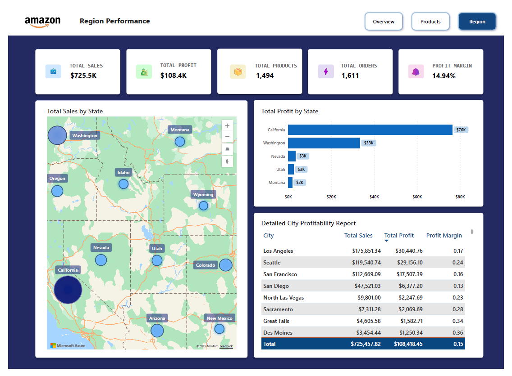

# Amazon Sales Dashboard (Power BI)
This project is a comprehensive Power BI dashboard that visualizes Amazon's sales performance across four years (2011-2014). This dashboard uncovers insights related to sales patterns, product performance, and regional trends to support better decision-making.

# 🔍 Dashboard Highlights
- Sales Overview
Visual presentation of total revenue, orders, quantity sold, profit, and average profit margin across years and months.
- Product-Level Analysis
Overview of top-performing products and categories based on sales volume and profitability.
- Regional Performance
Detailed breakdown of revenue and profits by U.S. state and city.

# Project Showcase
1. **Sales Trend**
   
2. **Product Analysis**
   
3. **Regional Performance Analysis**
   

# 📂 Dataset Information
The dataset used in this project is available on Kaggle: [Amazon Sales Dataset](https://www.kaggle.com/datasets/anandshaw2001/amazon-sales-dataset)

Key Columns:
- Order Date – Date when purchase was made
- Ship Date – Date item was shipped
- Email_ID – Customer’s email address
- Geography – Region (State, City)
- Category – Type of product
- Product Name – Specific product ordered
- Sales – Revenue from the sale
- Quantity – Units sold
- Profit – Net earnings from the transaction

# 🙋‍♂️ Author
Rich Edrick Anthonios

- **Github**: [Github](https://github.com/Richeaa)
- **Linkedin**: [Linkedin](https://www.linkedin.com/in/richea)
